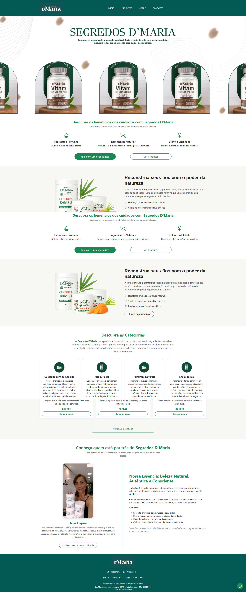
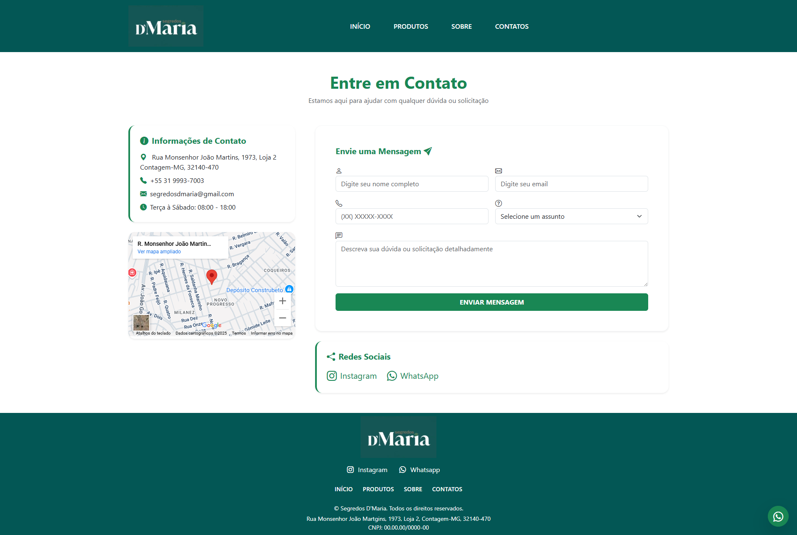
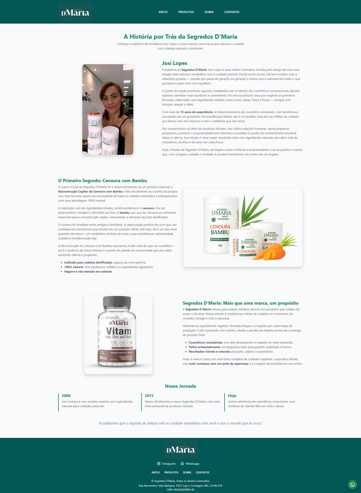

<h1 align="center">✨ Segredos D'Maria - Projeto de Site Institucional</h1>

<strong>Segredos D'Maria</strong> é uma marca de cosméticos capilares da minha cidade, e este projeto pessoal foi inspirado nela. Desenvolvi um site institucional completo com o objetivo de praticar minhas habilidades em desenvolvimento front-end, explorando formas de apresentar os valores da marca, seus produtos e facilitar o contato com o público.

---

## 🧼 Sobre a Marca

A **Segredos D'Maria** nasceu com o propósito de valorizar a beleza natural de todos os tipos de cabelo. Com fórmulas naturais, acessíveis e eficazes, a marca se posiciona como uma aliada de quem busca autoestima, cuidado e leveza no dia a dia.

---

## 🚀 O que esse projeto representa

Este site foi desenvolvido em **apenas dois dias**, como desafio pessoal para mostrar minha capacidade de organizar ideias, executar um layout funcional e entregar um resultado visualmente atrativo em pouco tempo.

Mesmo com o prazo curto, me dediquei ao máximo para refletir o cuidado e a identidade que uma marca como essa merece. Ainda pretendo evoluir o projeto com novas seções e melhorias.

🔗 [Acesse o projeto online](https://segredos-d-maria.vercel.app/)  

---

## 🖌️ Destaques do Site

- 🎨 **Visual delicado e profissional** que combina com o público-alvo  
- 📱 **Totalmente responsivo** para uma ótima navegação em qualquer tela  
- 🧴 **Apresentação clara dos produtos** e das categorias  
- 🔗 **Menu intuitivo** com acesso rápido às seções principais  
- 📬 **Formulário de contato funcional** para simular uma interação real

---

## 🔧 Tecnologias utilizadas

- **HTML5** — estrutura semântica e organizada  
- **CSS3** — estilização detalhada e personalizada  
- **JavaScript** — interações básicas e dinâmicas no site  
- **Bootstrap 5** — responsividade prática com componentes modernos

---

## 📘 Aprendizados na prática

Esse projeto me permitiu praticar e reforçar:

- Criação de um **layout elegante com foco em produto**  
- Organização de arquivos e boas práticas de HTML e CSS  
- Uso eficiente do **sistema de grid do Bootstrap**  
- Pensamento visual voltado à **experiência do usuário (UX)**

---

## 🖼️ Visão geral do projeto

### 🏠 Página Inicial  

### 🧴 Produtos em Destaque  

### ❤️ Conheça a Marca  

### 📬 Fale Conosco  

---

## 💬 Considerações finais

Projetos como esse são importantes para mostrar não só a parte técnica, mas também meu cuidado com os detalhes e com a apresentação de ideias. Estou sempre buscando melhorar e explorar novas abordagens visuais e funcionais.

---

Feito com carinho por **Ricardo Rodrigues**  
📎 [Conecte-se comigo no LinkedIn](https://www.linkedin.com/in/ricardo-rodrigues0/)
